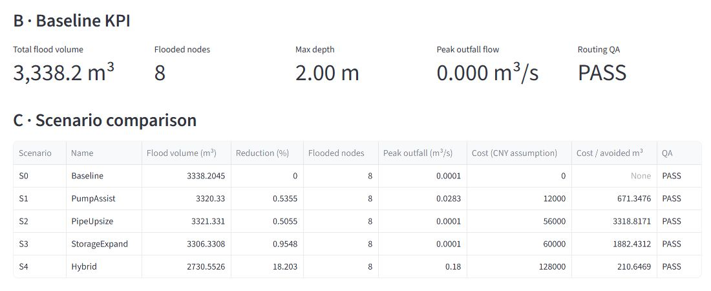
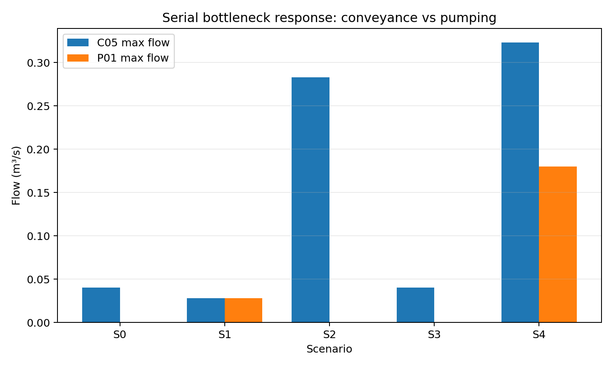
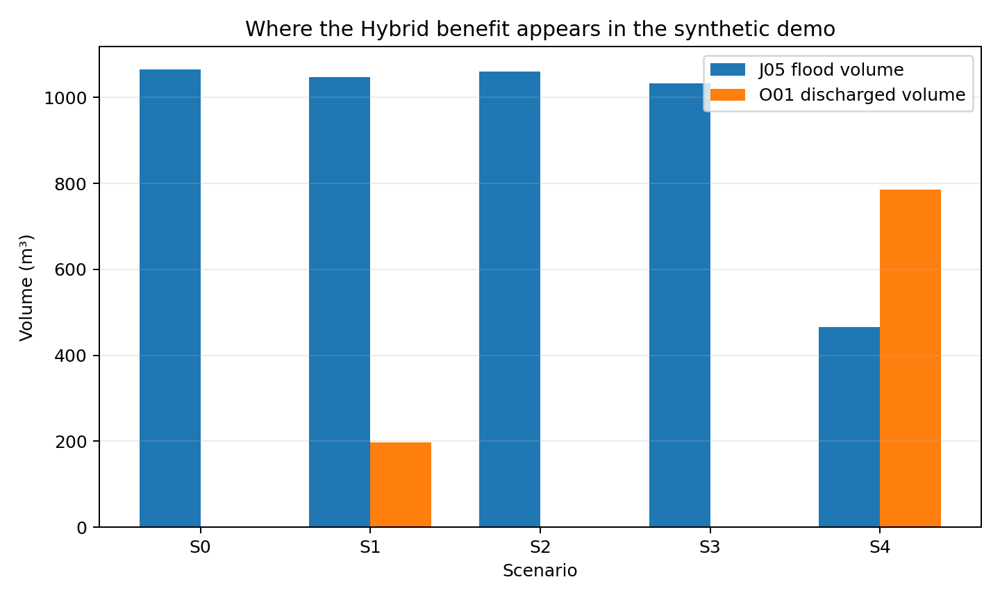

# SiteDrainGuard

[](https://github.com/Shiyisir/SiteDrainGuard/actions/workflows/ci.yml)

基于 Python、EPA SWMM 和 PySWMM 的施工场地暴雨积水与临时排水方案对比原型。

SiteDrainGuard is a Python + EPA SWMM + PySWMM prototype for comparing stormwater flooding risk and temporary drainage measures on a synthetic construction site.

本项目用于学习与方案决策支持。除非另有说明，内置场地、降雨、设施和成本均为合成演示数据。结果不能替代经过率定的工程设计、当地规范、专业审核、实测地形或现场监测。

It is an educational and decision-support prototype. The bundled site, rainfall, facility and cost data are synthetic unless explicitly stated otherwise. Results are not a substitute for calibrated engineering design, local codes, professional review, survey data or site monitoring.



上图截自实际运行的 Streamlit：Heavy 降雨、S0–S4 真实仿真后的结果表，非生成图或模拟截图。
Captured from the running Streamlit app after a real Heavy S0–S4 analysis; no generated or mock screenshot.

## 为什么做 / Why this project

用一个可检查、可本地复现的小模型，展示“降雨 → 真实水文水力仿真 → 场景参数变更 → 洪涝指标 → 成本假设 → 工程 QA”的完整流程。核心计算始终来自真实 SWMM 引擎。

The project demonstrates the complete, reproducible path from a rainfall event to a real hydrologic-hydraulic simulation, scenario mutation, flood metrics, cost assumptions and engineering QA. It is deliberately small enough to inspect and run locally, while preserving the important boundary that P0 results must come from the real SWMM engine.

## 已验证的合成演示 / Verified synthetic demo

Heavy 降雨历时 45 分钟，总雨量 40.83 mm，峰值强度 140 mm/h。内置模型在真实 SWMM 5.2.4 下的结果如下：

The current verified heavy event is 45 minutes, 40.83 mm total depth and 140 mm/h peak intensity. On the bundled model, the real SWMM 5.2.4 batch produced:

| 场景 / Scenario | 溢流体积 / Flood volume (m³) | 相对 S0 减少 / Reduction vs S0 | 路由 QA / Routing QA |
|---|---:|---:|---|
| S0 Baseline | 3,338.20 | 0.00% | PASS |
| S1 PumpAssist | 3,320.33 | 0.54% | PASS |
| S2 PipeUpsize | 3,321.33 | 0.51% | PASS |
| S3 StorageExpand | 3,306.33 | 0.95% | PASS |
| S4 Hybrid | 2,730.55 | 18.20% | PASS |

以上是本地真实计算快照，不是性能承诺或现场实测结果。可运行 `python scripts/run_demo_batch.py --rainfall heavy` 复现。
These numbers are a snapshot from a real local run, not a performance promise or field result. Recreate them with `python scripts/run_demo_batch.py --rainfall heavy`.

### 为什么组合效果非线性 / Why the Hybrid result is nonlinear

独立审查对照了保留的 SWMM 报告。结构审计确认 **S4 恰好是 S1、S2、S3 的变更并集**，没有额外 INP 参数变更，所有场景的降雨完全相同。

The large S4 improvement was independently checked against the retained SWMM reports instead of being accepted from the headline KPI alone. The structural audit verifies that **S4 is exactly the union of S1, S2 and S3**, with no extra INP token changes and identical rainfall across scenarios.

原因是合成模型中的串联瓶颈：`上游 upstream -> C05 -> ST01 -> P01 -> O01`。
The mechanism is a serial bottleneck in that synthetic path:

- **S1**：启用泵，但 0.20 m 的 C05 仍限制来水，P01 峰值只有 **0.028 m³/s**。 / Enables the pump, but the 0.20 m C05 still starves it; P01 peaks at only **0.028 m³/s**.
- **S2**：扩管后 C05 达到 **0.283 m³/s**，但出口泵仍近似关闭，水无法有效排出。 / Expands C05 to **0.283 m³/s**, but the outlet pump remains effectively off.
- **S3**：增加调蓄容量，但 C05 和出口仍限制容量的利用速度。 / Adds storage, but C05 and the outlet still constrain how quickly that capacity can be used.
- **S4**：同时改善输水、调蓄和外排，C05 达 **0.323 m³/s**，P01 达 **0.180 m³/s**，O01 排出 **786 m³**，J05 溢流由约 **1,065 降到 466 m³**。 / Relieves conveyance, storage and discharge together, reaching those flows and volumes.





S0→S4 共减少 **607.65 m³** 溢流，其中约 **599 m³（98.6%）** 来自瓶颈上游的 J05。这个非线性现象有局部水力机制支撑，不是隐藏的 S4 专属参数造成的；不能推广成“组合措施总是更好”。报告证据与复现命令见 [`docs/hybrid_synergy.md`](docs/hybrid_synergy.md)。

The S0→S4 flood-volume reduction is **607.65 m³**. About **599 m³ (98.6%)** occurs at J05, immediately upstream of the C05/ST01 bottleneck. The observed non-additivity is hydraulically localized rather than caused by an undeclared S4 mutation. It does not imply that combined measures are always better. See [`docs/hybrid_synergy.md`](docs/hybrid_synergy.md) for report-level evidence and the reproducible audit command.

## 快速开始 / Quick start

基准环境为 Python 3.11。在 Windows PowerShell 中执行：
The reproducible baseline is Python 3.11. On Windows PowerShell:

```powershell
uv venv --python 3.11 .venv
uv sync --locked --extra dev
.venv\Scripts\python.exe scripts\validate_environment.py
.venv\Scripts\python.exe scripts\run_demo_batch.py
```

也可以使用标准虚拟环境，再安装项目依赖：
Alternatively, use a standard virtual environment and install the project dependencies:

```powershell
python -m venv .venv
.venv\Scripts\python.exe -m pip install -e ".[dev]"
```

此处 `python` 应为 Python 3.11。macOS/Linux 将 `.venv\Scripts\python.exe` 换为 `.venv/bin/python`。
Use Python 3.11 for `python` above. On macOS/Linux, replace `.venv\Scripts\python.exe` with `.venv/bin/python`.

启动本地界面： / Start the local dashboard:

```powershell
.venv\Scripts\python.exe -m streamlit run app.py --server.headless true
```

选择降雨和方案，点击 `Run analysis` 才会运行 SWMM。修改成本假设只重算经济指标；修改降雨或方案后，需要重新点击运行。
The dashboard only runs SWMM after `Run analysis`. Cost edits recalculate economics from saved hydraulic results. Rainfall or scenario changes require a new analysis.

## 方案 / Scenarios

- **S0 Baseline**：基准临时排水系统。 / Base temporary drainage system.
- **S1 PumpAssist**：P01 从低能力 `PUMP_OFF` 曲线改为 `PUMP_ASSIST`。 / Changes P01 from `PUMP_OFF` to `PUMP_ASSIST`.
- **S2 PipeUpsize**：C05 管径由 0.20 m 改为 0.45 m。 / Changes C05 diameter from 0.20 m to 0.45 m.
- **S3 StorageExpand**：修改 ST01 调蓄曲线的两处白名单纵坐标。 / Changes two whitelisted storage-curve ordinates for ST01.
- **S4 Hybrid**：同时应用 S1、S2、S3 的变更。 / Applies the S1, S2 and S3 mutations together.

各方案从基础 INP 副本开始，生成 JSON 参数变更清单并串行运行；运行前后检查基础模型校验和。
Each scenario starts from a copied base INP, writes a JSON mutation manifest and runs sequentially. The bundled base INP is checksummed before and after a run.

## 验证与边界 / Validation boundary

节点溢流体积以 m³、时长以小时显示，已将 PySWMM 统计与 SWMM `.rpt` 报告交叉核对：体积换算后对应 `10^6 ltr`，时长对应 `Hours Flooded`。连续性误差读取报告/API 的百分比值。

The application reports node flood volume in m³ and duration in hours because the PySWMM values were cross-checked against the SWMM `.rpt` labels: node statistics align with the report's `10^6 ltr` aggregate after the m³-to-liter conversion, and duration aligns with `Hours Flooded`. Continuity uses the SWMM report/API percentage values.

QA 是本项目内部阈值：连续性误差绝对值 ≤2% 为 PASS，2–5% 为 WARNING，>5% 不参与有效排序。Rational Method 仅作数量级 sanity check，不是率定。降雨敏感性采用 0.8、1.0、1.2 倍强度。

QA gates are project-internal: absolute continuity error ≤2% is PASS, 2–5% is WARNING and >5% is invalid for ranking. Rational Method is a quantity sanity check, not calibration. Sensitivity uses rainfall intensity scales 0.8, 1.0 and 1.2.

激活虚拟环境后，运行完整验证： / Activate the virtual environment, then run the full validation:

```text
ruff check .
ruff format --check .
pytest --cov=src/sitedrainguard --cov-report=term-missing
python scripts/validate_environment.py
python scripts/run_demo_batch.py --rainfall moderate
python scripts/run_demo_batch.py --rainfall heavy
python scripts/audit_hybrid_synergy.py
```

## 目录结构 / Project structure

```text
app.py                         界面 / Streamlit UI
src/sitedrainguard/             核心计算与 QA / domain, engine, metrics and QA
data/demo_site/                 合成输入 / synthetic INP, rainfall and costs
tests/                         单元与真实引擎测试 / unit and integration tests
scripts/                       验证和批处理 / validation, batch CLI and S4 audit
docs/                          方法与证据 / methodology, evidence and limits
assets/                        真实截图与报告图 / real screenshot and evidence plots
AGENTS.md / CONTEXT.md          AI 规则与业务背景 / rules and business context
AUDIT_REPORT.md                 基于证据的自审计 / evidence-based self-audit
```

## 已知限制与发布状态 / Known limitations and release status

模型使用合成数据，未经过现场率定。没有实测 DEM、当地设计暴雨生成器、实时监测、不确定性量化、规范符合性判断或生产级多用户并发。成本均为用户假设，v0.1 不接受任意自定义 INP。

The model is synthetic and not calibrated. It has no survey DEM, local design-storm generator, live monitoring, uncertainty quantification, code-compliance judgement or production multi-user concurrency. Costs are user assumptions. v0.1 does not accept arbitrary user INP files.

发布条件见 [`RELEASE_CHECKLIST.md`](RELEASE_CHECKLIST.md)。独立审查后的本地复验在 Windows/Python 3.11.12 上通过 19 个测试，覆盖率 85%；GitHub 托管 CI 在 Ubuntu / Python 3.11.16 上同样通过 19 个测试、85% 覆盖率及真实 Heavy 批处理和 Hybrid audit。[运行证据](https://github.com/Shiyisir/SiteDrainGuard/actions/runs/34111256789)。

The public-release gate is tracked in [`RELEASE_CHECKLIST.md`](RELEASE_CHECKLIST.md). Local post-review verification passed 19 tests with 85% coverage on Windows/Python 3.11.12. Hosted GitHub Actions also passed 19 tests with 85% coverage, the real Heavy batch and Hybrid audit on Ubuntu / Python 3.11.16. [Run evidence](https://github.com/Shiyisir/SiteDrainGuard/actions/runs/34111256789).

## 许可与致谢 / License and attribution

项目采用 MIT 许可证，作者署名 Shiyisir。通过 PySWMM/swmm-toolkit 使用美国 EPA SWMM，不是 EPA 官方产品。第三方声明与引用见 [`THIRD_PARTY_NOTICES.md`](THIRD_PARTY_NOTICES.md) 和 [`CITATION.cff`](CITATION.cff)。

The project is MIT licensed. It uses the U.S. EPA Storm Water Management Model through PySWMM/swmm-toolkit and is not an official EPA product. See [`THIRD_PARTY_NOTICES.md`](THIRD_PARTY_NOTICES.md) and [`CITATION.cff`](CITATION.cff).
